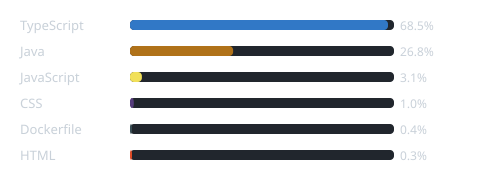
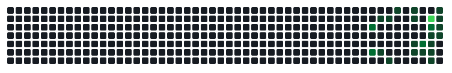

---

## 🚀 Sobre a Nexus Hub Dev

A **Nexus Hub Dev** é uma organização criada por estudantes e desenvolvedores em formação com o objetivo de **aprender, praticar e construir projetos de software em equipe**.

Nosso foco é transformar conhecimento em experiência através de projetos reais, colaboração e aprendizado contínuo.

> **Estude hoje, lidere amanhã.**

---

## 🎯 Nosso objetivo

Criar um ambiente colaborativo onde possamos:

* 📚 Aprender novas tecnologias
* 💻 Praticar desenvolvimento de software
* 🤝 Trabalhar em equipe
* 🚀 Criar projetos reais
* 🧠 Compartilhar conhecimento
* 🎯 Desenvolver experiência profissional

---

## 📚 O que estamos estudando

| Área                   | Tecnologias                     |
| ---------------------- | -------------------------------- |
| ☕ **Backend**          | Java • Spring Boot • APIs REST  |
| ⚛️ **Frontend**        | React • TypeScript • JavaScript |
| 🗄️ **Banco de Dados** | MySQL • PostgreSQL              |
| 🔐 **Segurança**       | Spring Security • JWT           |
| 🎨 **Interface**       | HTML • CSS • Tailwind CSS       |
| 🧰 **Ferramentas**     | Git • GitHub • VS Code          |

---

## 🛠️ Tech Stack

---

## 🚀 Projetos em destaque

### 🚌 Carona React

Sistema desenvolvido para conectar **motoristas e passageiros**, explorando conceitos de frontend, APIs e integração entre sistemas.

 

### 🚚 Delivery React

Aplicação de delivery desenvolvida para praticar desenvolvimento frontend, componentes reutilizáveis e integração com APIs.

---

## 📊 Linguagens mais utilizadas

Soma dos bytes de código de todos os repositórios não arquivados da organização, gerado pelo mesmo workflow.

---

## 📈 Atividade combinada da organização

Este gráfico soma os commits de **todos os repositórios não arquivados** da Nexus Hub Dev, dia a dia, nas últimas 52 semanas. Ele é atualizado automaticamente todo dia pelo workflow `org-activity.yml`.

---

## 🤝 Como contribuir

A **Nexus Hub Dev** é um espaço de aprendizado colaborativo.

Você pode contribuir através de:

* 💻 Desenvolvimento
* 🐛 Correção de bugs
* 🎨 Frontend e UI/UX
* 🗄️ Backend e banco de dados
* 📝 Documentação
* 💡 Ideias e sugestões
* 🔍 Revisão de código

Explore nossos repositórios e participe dos projetos.

---

## 🧭 Nossa jornada

### 📚 Aprender

⬇️

### 💻 Praticar

⬇️

### 🤝 Colaborar

⬇️

### 🚀 Construir

⬇️

### 🎯 Evoluir

---

### 💙 Nexus Hub Dev

**Estude hoje. Pratique amanhã. Construa seu futuro.**

 

  

